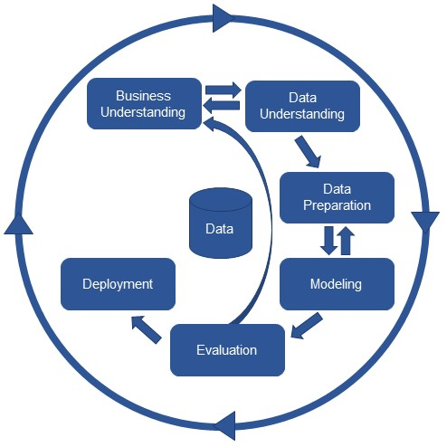

# Is Data Science a Hype?

# What is Data Science?

- Data Analytics, Data Mining, Stats, Big Data, **ML**, Predictive Analytics?
- Data Science is: making sense of Data
- Data Science is: multidisciplinary (Stats, Math, CS, Domain Experts)    
     
Data Science is the science which uses computer science, statistics and machine learning, visualization and human-computer interactions to collect, clean, integrate, analyze, visualize, interact with data to create data products.
     

## Data Science Lifecycle

## Machine Learning
    
According to Arthur Samuel, Machine Learning algorithms enable the computers to **learn from data**, and even improve themselves, without being explicitly programmed.
                         
### Types of Machine Learning:    
* Supervised Learning       
    -  Classification (spam or not spam; disease or not)    
    -  Regression (value for dollars or weight)     
* Unsupervised Learning          
    -  Clustering (inheret grouping in data)    
    -  Association (rules describing your data; people that buy X also tend to buy Y)    
* Reinforcement Learning         
A reinforcement learning algorithm, or agent, learns by interacting with its environment.   

## Common Examples

-  Classification and class probability estimation: Cancer or Benign?
-  Regression: How much will you use the service?
-  Similarity Matching: Recommender systems/similarity
-  Clustering: Can you find natural groups in your data set?

## Deployment

Some examples - Deployments depends on the application:
- Machine Learning Server in MS SQL 2017 (R&Python; Cloud and on-prem)
- Containers and Orchestration (Docker and Aks)
- cortex.dex (AWS, Docker and EKS)
- ML Ops (Azure)
- Databricks

## Applications of Data Science
- Fraud and Risk Detection
- Healthcare
- Internet Search
- Targeted Advertising
- Website Recommendations
- Advanced Image Recognition
- Speech Recognition
- Airline Route Planning
- Gaming
- Augmented Reality

### References:

 http://homepages.vub.ac.be/~tiasguns/      
 https://machinelearningmastery.com/finalize-machine-learning-models-in-r/      
 https://www.geeksforgeeks.org/introduction-machine-learning-using-python/      
 https://medium.com/machine-learning-for-humans/why-machine-learning-matters-6164faf1df12    

 
